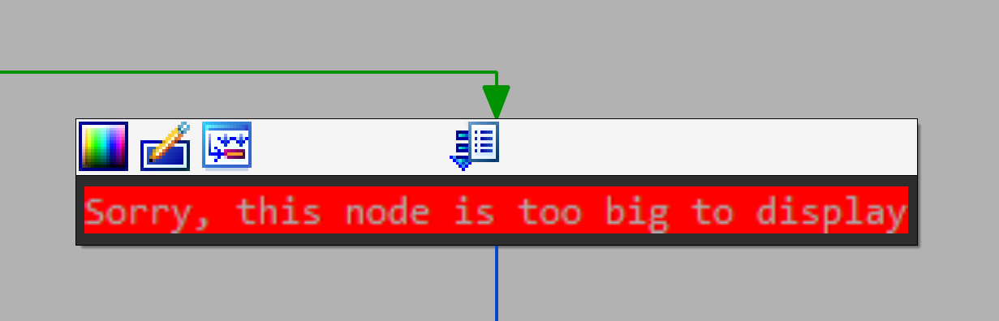
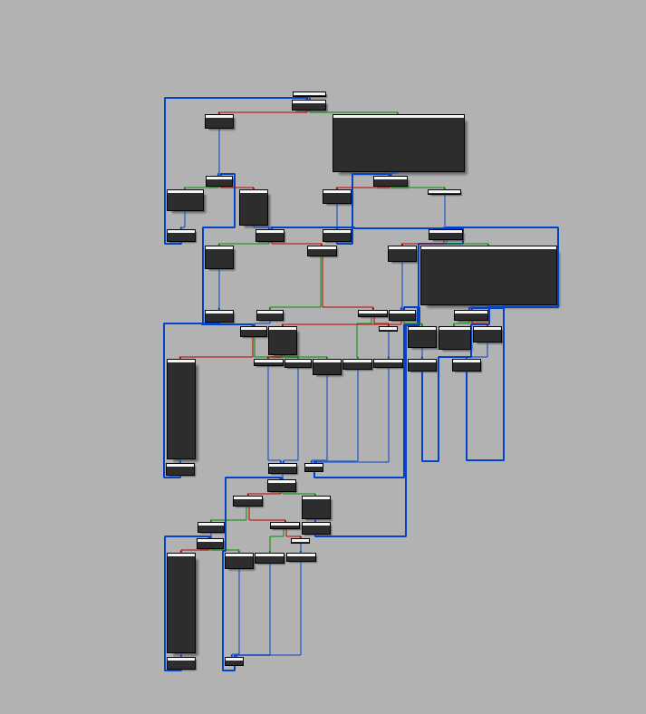

# AutoCrypt
header-only C++20 string obfuscator that hides literals from .rdata via compile-time DFA
## Features

- no plaintext strings via static analysis
- compile-time dfa
- strict memory wiping
- emulator makes brrr
- not xor

## how it works
- **compile-time:** custom fnv-1a + bitwise shifts encrypt your strings into a multi-layer dfa matrix. each `AUTOSTR` macro call uses `__TIMESTAMP__` and `__COUNTER__` for uniq key
- **runtime:** decrypts data in reverse order using a volatile state-machine loop
- **security:** strings live only on the stack as temporaries and get forcibly wiped with zeroes right after destruction

## Usage

```cpp
#include <iostream>
#include <string>
#include "autocrypt.hpp"

int main() {     // @ default usage:
    std::cout << AUTOSTR("enter key: ");
    std::string input;
    std::cin >> input;

    if (input == AUTOSTR("super_secret")) {
        std::wcout << AUTOSTR(L"done") << std::endl;         // output encrypted wide string
    } else {
        std::wcout << AUTOSTR(L"denied") << std::endl;
    }

    return 0;
}

```

## IDA Pro Example

<table width="100%">
  <tr>
    <td align="center" valign="center" width="60%">
      
    </td>
    <td align="center" valign="center" width="40%">
      
    </td>
  </tr>
</table>
